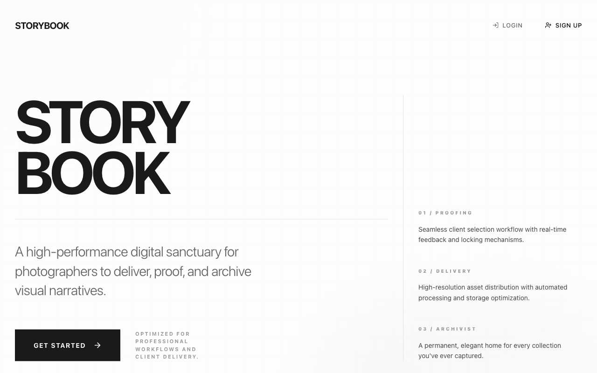
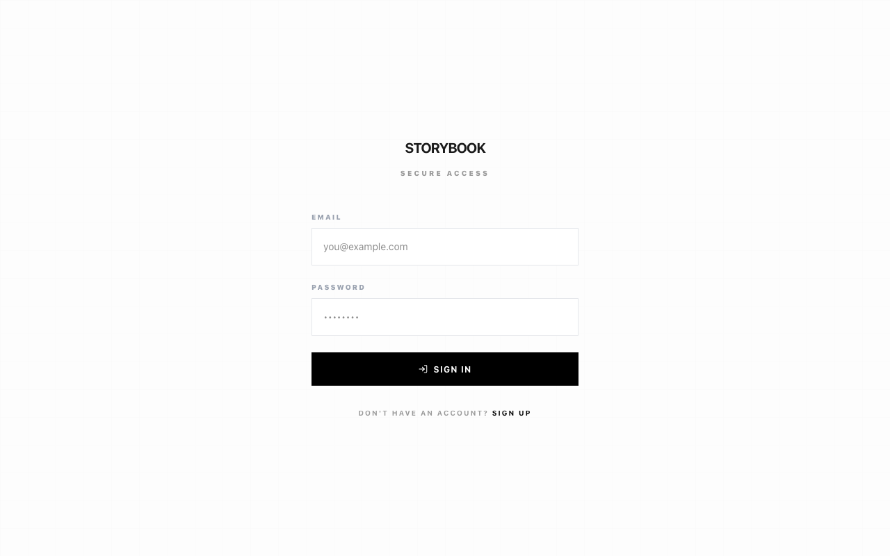
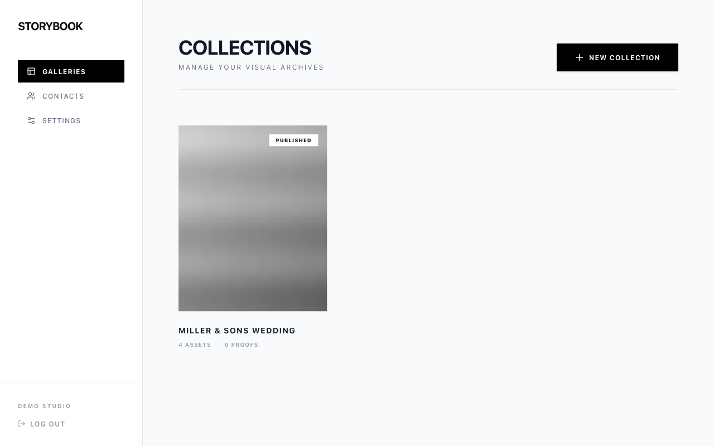
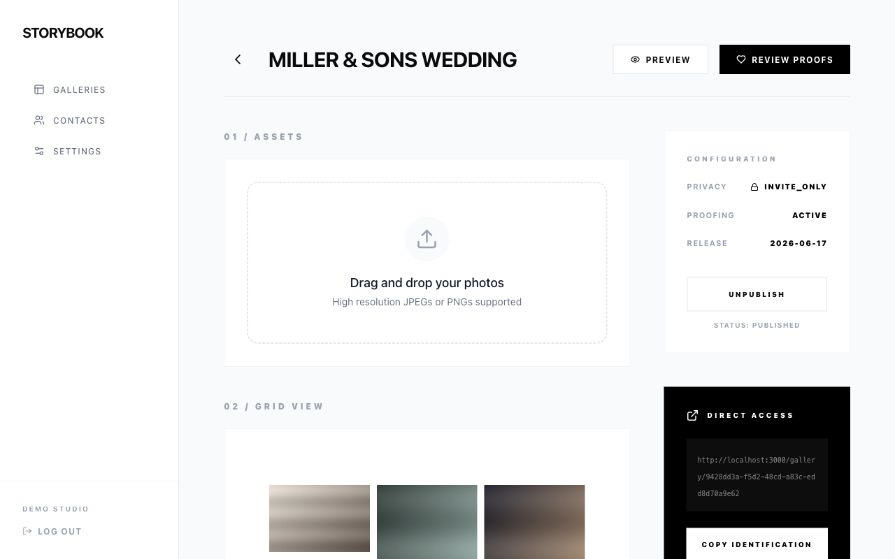
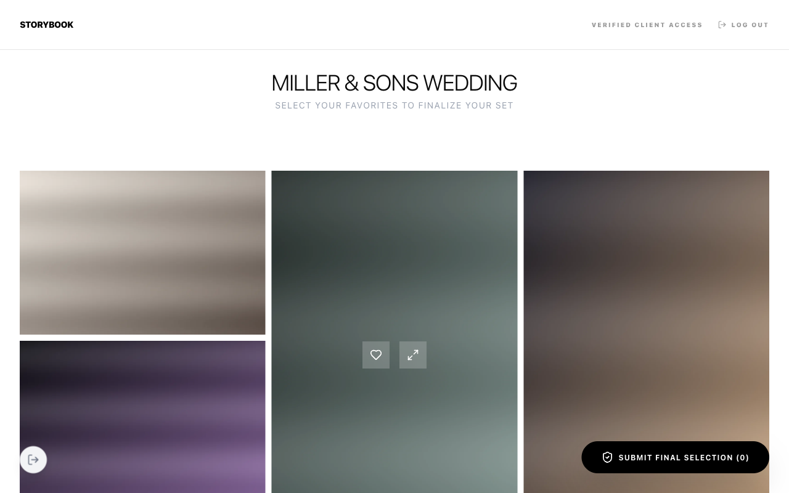
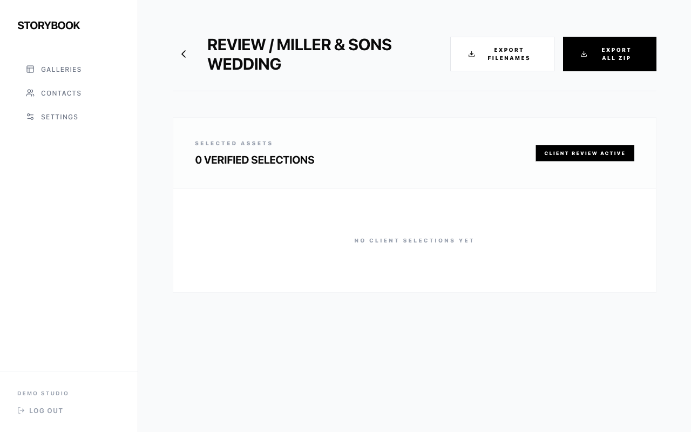
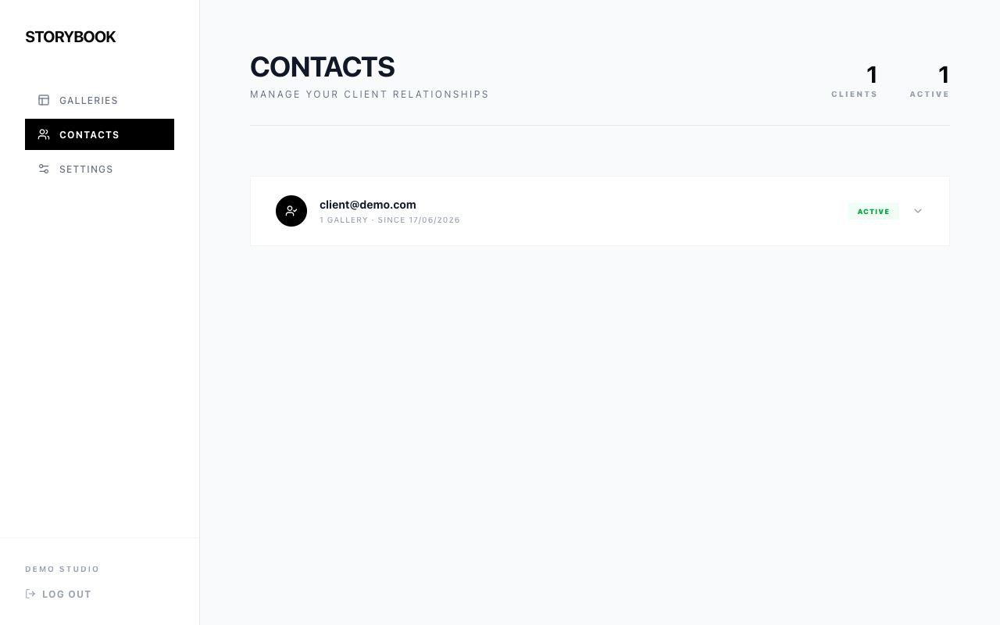
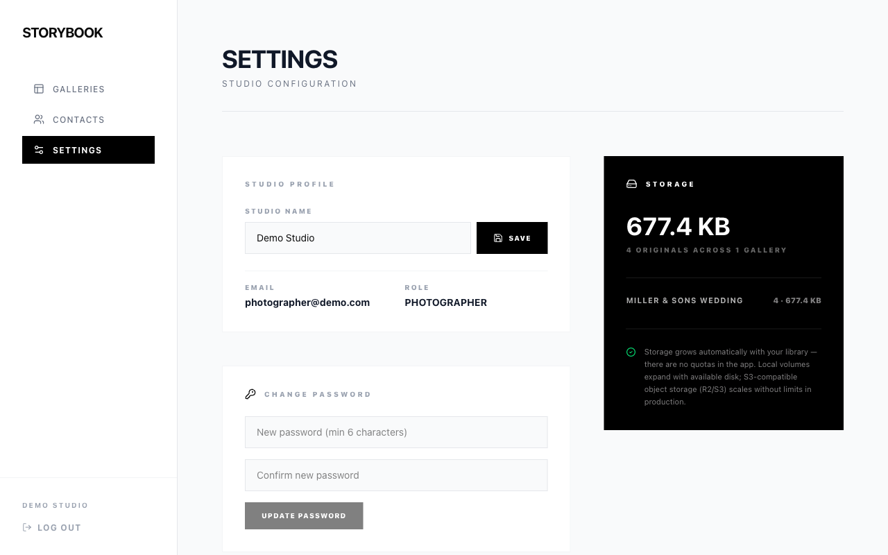

# StoryBook — Client Gallery Suite

A production-grade client gallery platform for professional photographers — think Pixieset or Pic-Time. Photographers upload photos, organize them into galleries, and invite clients via secure token links; clients proof their selections with favorites, ratings, and comments. The entire stack runs with **one command**.



## Quick Start (one command)

```bash
docker compose up -d --build
```

Then open **http://localhost:3000** and sign in:

| Role | Email | Password |
|------|-------|----------|
| Photographer | `photographer@demo.com` | `password123` |
| Client | `client@demo.com` | `password123` |

That single command brings up Postgres, Supabase Auth (GoTrue), PostgREST, an nginx API gateway, MinIO object storage, the Next.js web app, and the image-processing worker — plus one-shot jobs that create the storage buckets, apply database migrations, and seed demo data (including real processed demo photos). No Supabase CLI, no pnpm, no manual steps.

**Prerequisite:** Docker Desktop (or Docker Engine + Compose v2).

> If port 3000 is in use on your machine, create a `docker-compose.override.yml` mapping another port (e.g. `3001:3000`) for the `web` service.



## What It Does

### For photographers

- Sign up and get a studio workspace automatically
- Create galleries with privacy, download, watermark, and proofing settings
- Drag-and-drop upload — files go **directly to object storage** via presigned URLs, then a background worker generates web-optimized WebP derivatives and thumbnails and strips GPS EXIF data
- Publish/unpublish galleries and invite clients by email (secure SHA-256-hashed token links; shown in-app for manual sharing when no email provider is configured)
- Review client selections, ratings, and notes in the proofing view
- Export selected (or all) photos as a ZIP archive with a download link
- Manage client relationships in **Contacts** and studio profile, password, and storage usage in **Settings**




### For clients

- Accept an invite link → sign up (automatically as a client) → instant gallery access
- Browse photos in a responsive masonry grid with a full-screen lightbox
- Heart favorites, rate photos 0–5 stars, and leave notes for the photographer
- Submit a final locked selection



### Proofing & exports

The photographer's proofing view shows verified selections, submission status, per-photo client ratings and comments (in the lightbox), and an export archive list with live status and download links.



### Contacts & settings




## Architecture

```
client-gallery-suite/
├── apps/
│   ├── web/            # Next.js 15 (App Router) — pages, server actions, API routes
│   └── worker/         # Node.js + sharp — image processing & ZIP exports (pg-boss queue)
├── packages/
│   └── shared/         # Zod schemas, S3 helpers, constants — shared across apps
├── infra/
│   ├── docker/         # Self-contained stack support: gateway config, db-init, seeder
│   ├── local/          # Lighter dev compose (web + worker + MinIO; Supabase via CLI)
│   └── scripts/        # Host-side setup + seed scripts for the CLI workflow
├── supabase/
│   ├── config.toml     # Local Supabase CLI config
│   └── migrations/     # Postgres schema with Row Level Security
└── docker-compose.yml  # ← the one-command, fully self-contained stack
```

### Services in the self-contained stack

| Service | Image | Purpose |
|---------|-------|---------|
| `db` | supabase/postgres 15 | Postgres with Supabase roles/extensions |
| `auth` | supabase/gotrue | Authentication (email/password, JWT) |
| `rest` | postgrest | Auto-generated data API over Postgres with RLS |
| `gateway` | nginx | Routes `/auth/v1/*` and `/rest/v1/*`, handles CORS (port **54321**) |
| `minio` | minio | S3-compatible object storage (ports **9000**/**9001**) |
| `web` | built from `apps/web` | Next.js app, standalone output (port **3000**) |
| `worker` | built from `apps/worker` | pg-boss consumer: derivatives + ZIP exports |
| `minio-init`, `db-init`, `seed` | one-shot | Buckets, migrations (idempotent), demo data |

### How a photo flows

1. Browser requests presigned PUT URLs (`/api/upload-urls`) — a photo row is created per file
2. Browser uploads **directly to MinIO/S3** (the app server never proxies file bytes)
3. `/api/upload-complete` enqueues a `process-photo` job via a Postgres RPC into pg-boss
4. The worker downloads the original, generates a 2048px WebP + 400px thumbnail (optional watermark), strips GPS EXIF, uploads derivatives, and marks the photo `ready`
5. The UI polls until processing finishes; all viewing goes through short-lived presigned GET URLs (`/api/signed-urls`)

## Tech Stack

| Layer | Technology |
|-------|-----------|
| Frontend | Next.js 15 (App Router), React 18, TypeScript, Tailwind CSS 4 |
| UI | Radix UI + shadcn/ui, Lucide icons, Motion |
| Auth & DB | Supabase (GoTrue + Postgres + Row Level Security via PostgREST) |
| Storage | S3-compatible — MinIO (local) / Cloudflare R2 / AWS S3 (production) |
| Job queue | pg-boss (Postgres-backed, no extra broker) |
| Worker | Node.js + sharp (libvips) |
| Email | Resend (when `RESEND_API_KEY` is set) / in-app invite links + `dev_emails` sink |
| Monorepo | pnpm workspaces + Turborepo |

## Database

Twelve tables, **Row Level Security on every one**: `profiles`, `galleries`, `gallery_memberships`, `invitations`, `photos`, `proof_favorites`, `proof_ratings`, `proof_comments`, `submissions`, `exports`, `audit_events`, `dev_emails`.

- Photographers have full CRUD on their own data; clients only see galleries they're members of and manage their own favorites/ratings/comments
- Cross-table policies use `SECURITY DEFINER` helper functions (`is_gallery_member`, `owns_gallery`) to avoid RLS recursion
- Invitation acceptance and job enqueueing run through `SECURITY DEFINER` RPCs (`accept_invitation`, `insert_pgboss_job`) so clients never need broad table permissions

## Storage Scaling

There are **no storage quotas anywhere in the app** — capacity grows with your library automatically:

- **Local (Docker):** photos live in the `minio-data` volume and the database in `db-data`; both expand with available host disk (`docker system df -v` to inspect)
- **Production:** point the `S3_*` env vars at any S3-compatible store (Cloudflare R2, AWS S3, Backblaze B2) — object storage scales elastically with no provisioning
- Uploads go directly from the browser to storage via presigned URLs, so app servers never bottleneck on file size or volume
- Current per-gallery usage is shown in **Admin → Settings → Storage**

## Security

- **Invite tokens** stored as SHA-256 hashes; the raw token is never persisted
- **Media access** is private by default — served via short-lived presigned GET URLs (15 min)
- **Uploads** go direct to storage via presigned PUT URLs
- **GPS EXIF** stripped during processing
- **Authorization**: server-side ownership checks plus Postgres RLS on every table; role separation keeps clients out of the studio admin
- All credentials in `docker-compose.yml` are well-known local demo values — **replace every secret before deploying anywhere public**

## Development

For day-to-day development with hot reload, use the hybrid workflow (requires Node ≥ 20, pnpm ≥ 9, and the Supabase CLI):

```bash
pnpm install
cp .env.example .env && cp .env.example apps/web/.env.local
pnpm run setup:infra          # Supabase CLI stack + MinIO + worker + buckets + migrations
pnpm run db:seed              # demo accounts and data
pnpm dev                      # all apps with hot reload via Turborepo
```

| Command | Purpose |
|---------|---------|
| `pnpm build` | Production build of all packages |
| `pnpm --filter @gallery/shared test` | Unit tests (Zod schemas) |
| `pnpm --filter @gallery/web test:e2e` | Playwright smoke tests |
| `npx supabase migration new <name>` | New database migration |

Local service URLs: app `:3000` · Supabase API gateway `:54321` · Supabase Studio `:54323` (CLI workflow only) · MinIO S3 `:9000` · MinIO console `:9001` (`minioadmin`/`minioadmin`).

### Production notes

- `NEXT_PUBLIC_*` values are baked into the web image at **build time** — pass them as build args when building for another host
- Set `RESEND_API_KEY` to send real invitation emails; without it, invite links surface in the editor UI for manual sharing
- Swap `DATABASE_URL`/`S3_*`/Supabase URLs to managed services; no code changes required

## Routes

| Route | Description |
|-------|-------------|
| `/` | Landing page |
| `/auth/login` · `/auth/signup` | Authentication (invite-aware redirects) |
| `/admin/galleries` | Gallery dashboard (photographer) |
| `/admin/editor/[id]` | Upload, configure, publish, invite |
| `/admin/proofing/[id]` | Review selections, ratings, comments; ZIP exports |
| `/admin/contacts` | Client relationship overview |
| `/admin/settings` | Studio profile, password, storage usage |
| `/gallery` | Client's gallery list |
| `/gallery/[id]` | Client gallery: favorites, ratings, comments, submission |
| `/invite/accept` | Token-based invitation acceptance |
| `/api/upload-urls` · `/api/upload-complete` · `/api/signed-urls` | Upload + signed media APIs |
